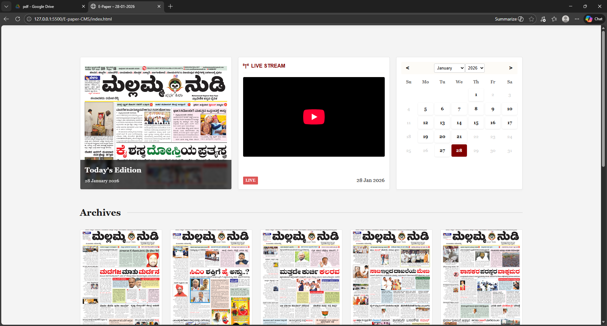
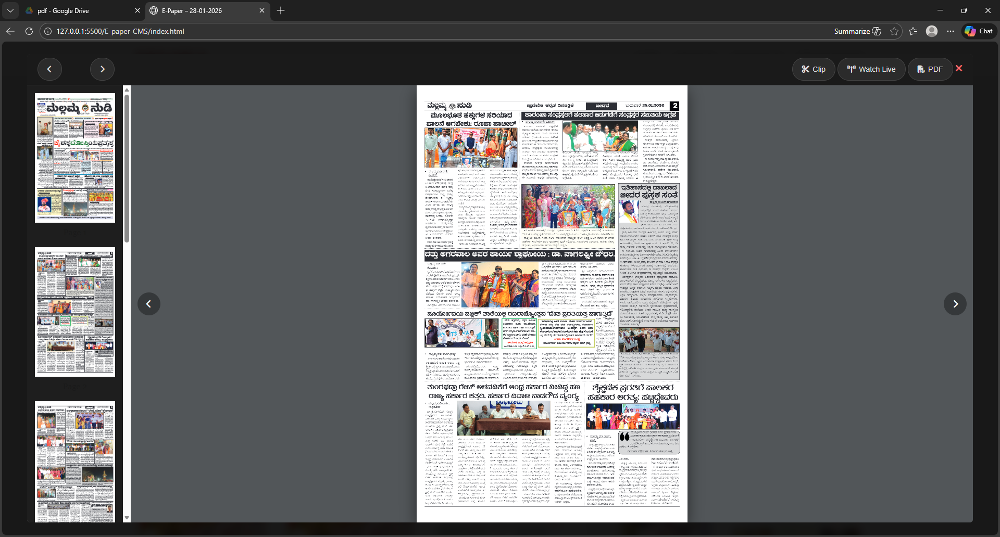

# EELOKA CMS

A dynamic AI-assisted E-paper CMS platform that automatically fetches and displays newspaper PDFs from Google Drive in real time. The system is designed for digital newspaper publishing with automated archive management, responsive viewing, PDF rendering, clipping/sharing tools, and live updates.

---

## Previews


*Eeloka CMS Homepage*


*Immersive Newspaper Viewer*

---

## Features

### Automated Google Drive Integration

* Google Drive acts as the single source of truth.
* Newspapers are uploaded directly to a Drive folder.
* PDFs are automatically discovered and rendered on the website.
* File naming convention:

  ```text
  DD-MM-YYYY.pdf
  ```
* Only dates available in Drive appear on the website.

---

### Dynamic Newspaper Rendering

* Today’s paper is automatically detected from the latest available PDF.
* Previous papers move to the archive automatically.
* No manual frontend updates required.

---

### Smart Archive Management

* Auto-refreshes Drive cache periodically.
* Retention policy:

  * Maximum 30 newspapers retained.
  * Older papers are automatically removed.
* Optimized for storage efficiency.

---

## Newspaper Viewer

### Full-Screen Reader Experience

* Responsive newspaper viewing interface.
* Mobile and desktop optimized layouts.
* Large-screen mode includes:

  * Vertical page thumbnails
  * Fast page navigation
* Mobile mode hides thumbnails for cleaner UX.

---

### Interactive Features

* PDF open/view mode
* Live stream popup integration
* Next/Previous page navigation
* Auto-hiding overlay navigation controls
* Smooth page transitions

---

### Clipping Tool

Users can:

* Select portions of a newspaper page
* Capture clipped regions
* Share snippets using social media buttons
* Download clipped content locally

---

## Backend Architecture

### Tech Stack

* Node.js
* Express.js
* Google Drive API
* Railway Deployment

### Backend Responsibilities

* Discover PDFs from Drive
* Parse filenames into publication dates
* Generate paper metadata
* Serve API endpoints
* Cache responses in memory
* Manage retention policy
* Proxy PDF/preview requests

---

## API Endpoints

### Papers

```http
GET /api/papers
```

Returns all available newspapers.

---

### Today's Paper

```http
GET /api/papers/today
```

Returns the latest newspaper.

---

### Calendar Availability

```http
GET /api/calendar/:year/:month
```

Returns only dates available in Drive.

---

### PDF Access

```http
GET /api/papers/:isoDate/pdf
```

Opens the selected newspaper PDF.

---

## Frontend Architecture

### Tech Stack

* HTML
* CSS
* Vanilla JavaScript
* PDF.js

### Frontend Responsibilities

* Fetch papers dynamically from backend APIs
* Render archives and calendar
* Open viewer modal
* Handle page navigation
* Render thumbnails
* Manage clipping functionality
* Responsive UX behavior

---

## Deployment

### Frontend

* Hosted on Railway/Vercel
* Static deployment

### Backend

* Hosted on Railway
* Uses environment variables for:

  * Google Drive folder ID
  * Drive API credentials
  * Production port binding

---

## Project Workflow

1. Client uploads newspaper PDF to Google Drive.
2. Backend auto-discovers the new file.
3. Cache refresh updates available papers.
4. Frontend fetches latest metadata.
5. Today’s paper updates automatically.
6. Older papers shift into archives.
7. If paper count exceeds 30:

   * oldest papers are removed automatically.

---

## Responsive Design

* Desktop immersive viewer
* Mobile-optimized controls
* Touch-friendly navigation
* Sticky header/footer interactions

---

## Future Improvements

* OCR-based article extraction
* Search inside newspapers
* AI article summarization
* Multi-language editions
* Admin dashboard
* Analytics panel
* User bookmarks/history

---

## Author

Built by Lohitha 🚀
